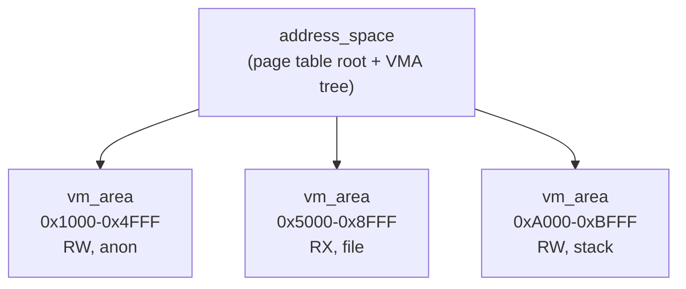
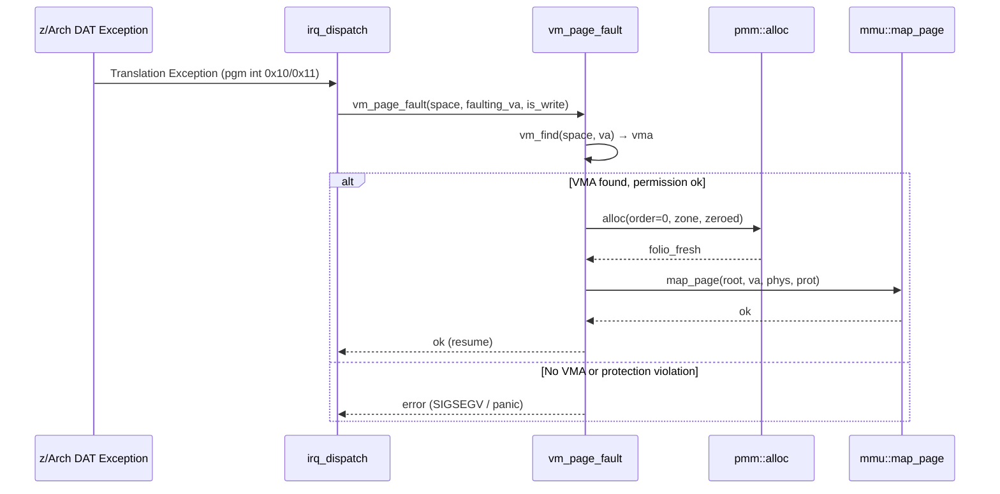

# VM Architecture Plan

## Current State — What Exists

| Layer | Status | What It Provides |
|-------|--------|-----------------|
| **PMM** | ✅ Complete | Buddy allocator, folio typestate, per-frame refcounting, PCP fast path, transactional multi-alloc |
| **MMU** | ✅ Complete | `map_page`, `map_range`, `unmap`, `walk`, `protect` — all transactional with rollback |
| **HHDM** | ✅ Complete | Linear phys↔virt at `0xFFFF'8000'0000'0000` |
| **Intrusive List** | ✅ Complete | `lib::list_node` / `list_head` — full doubly-linked |
| **Tree/Map** | ❌ **MISSING** | Zero sorted container in the entire codebase |
| **VMM** | ❌ **MISSING** | No virtual address space manager |

---

## Phase 0 — Data Structure Selection

We need an **interval container** for VMA tracking. This is THE critical data structure — every `mmap`, `munmap`, `page_fault` hits it.

### The Contenders

```
                    RB-Tree          Maple Tree          AVL Tree
━━━━━━━━━━━━━━━━━━━━━━━━━━━━━━━━━━━━━━━━━━━━━━━━━━━━━━━━━━━━━━━━
Lookup              O(log n)         O(log n)            O(log n)
Insert              O(log n)         O(log n)            O(log n)
Delete              O(log n)         O(log n)            O(log n)
Range query         O(log n + k)     O(log n + k)        O(log n + k)
Rotations/rebal     ≤3 per op        bulk node splits    ≤2 per op
Height guarantee    ≤2·log₂(n+1)     ≈log_B(n)           ≤1.44·log₂(n)
Cache behavior      Poor (1 node     GOOD (B-tree,       Poor (same as
                    per cacheline)   multiple keys/node)  RB-tree)
RCU compatibility   Hard (pointer    DESIGNED for it     Hard
                    rotations)       (no pointer swing)
Freestanding impl   ~300 lines       ~1200 lines         ~250 lines
Memory overhead     3 ptrs + color   amortized lower     2 ptrs + height
                    = 25 bytes/node  per key             = 24 bytes/node
```

### My Recommendation: **Red-Black Tree first, Maple Tree later**

> [!IMPORTANT]
> **Build an intrusive RB-tree now.** It's the right 80/20 choice:
> - ~300 lines of freestanding C++23, no allocation needed (intrusive)
> - Every OS kernel in history has validated this design
> - We can swap the VMA container to maple tree later without changing the VMA API
> - Maple tree is 4× the code and only wins at cache pressure with thousands of VMAs — we won't have that for a long time

**AVL**: Slightly faster lookup (stricter balance), slightly slower mutation. No meaningful advantage over RB for our workload. Skip.

**Maple Tree**: The Linux 6.1 move was driven by RCU-safe iteration during `fork()` and cache pressure at >100 VMAs. We don't have `fork()` or userspace yet. Build it when we need it.

---

## Phase 1 — Intrusive RB-Tree (`lib/rbtree.cxxm`)

```cpp
/// Intrusive red-black tree node — embed in any struct.
struct rb_node {
    rb_node*  parent;    ///< Parent (color in low bit via tagged pointer).
    rb_node*  left;      ///< Left child.
    rb_node*  right;     ///< Right child.
};

/// Intrusive red-black tree root.
struct rb_root {
    rb_node* node{nullptr};  ///< Root node (nullptr = empty tree).
};

/// Augmented root (caches leftmost for O(1) begin()).
struct rb_root_cached {
    rb_root  root{};
    rb_node* leftmost{nullptr};
};
```

**API** (all `noexcept`, all `O(log n)`):

```cpp
auto rb_insert_color(rb_node* node, rb_root& root) noexcept -> void;
auto rb_erase(rb_node* node, rb_root& root) noexcept -> void;
auto rb_first(const rb_root& root) noexcept -> rb_node*;
auto rb_last(const rb_root& root) noexcept -> rb_node*;
auto rb_next(const rb_node* node) noexcept -> rb_node*;
auto rb_prev(const rb_node* node) noexcept -> rb_node*;
auto rb_replace(rb_node* old_node, rb_node* new_node, rb_root& root) noexcept -> void;

/// Typed iterator using container_of — same pattern as lib::list.
template <typename Owner, rb_node Owner::* member>
class rb_iterator;
```

> [!NOTE]
> The caller provides the comparison logic and performs the BST walk for insertion.
> The tree only handles rebalancing (`rb_insert_color`) and removal (`rb_erase`).
> This is the same design as Linux's `rbtree.h` — maximally flexible.

---

## Phase 2 — VMA Types (`zxfoundation/memory/vm_types.cxxm`)



```cpp
/// @brief Virtual memory area — represents a contiguous range of
///        virtual addresses with uniform protection and backing.
struct vm_area : kernel_object<tag_virt_region> {
    u64             va_start;        ///< Start address (page-aligned, inclusive).
    u64             va_end;          ///< End address (page-aligned, exclusive).
    vm_prot         prot;            ///< Access protection (read/write/execute).
    vm_flags        flags;           ///< Mapping flags (shared, private, growable, ...).
    u32             _pad;

    // ── Tree linkage ──
    rb_node         rb_link;         ///< RB-tree node for address-ordered lookup.

    // ── List linkage ──
    list_node       list_link;       ///< Ordered linked list for linear iteration.

    // ── SCOMS ──
    scoms::object_node scoms_node;   ///< SCOMS registry node.

    // ── Non-copyable, non-movable ──
    vm_area(const vm_area&) = delete;
    auto operator=(const vm_area&) = delete;
};
```

```cpp
/// @brief Virtual address space — owns a page table root and a set of VMAs.
struct address_space {
    typed_asce<dat_level::region_1>  asce;     ///< z/Arch ASCE for this space.
    dat_table<dat_level::region_1>   root;     ///< Root page table.

    rb_root_cached  vma_tree{};                ///< RB-tree of VMAs (by va_start).
    list_head       vma_list{};                ///< Linked list for linear walk.
    u32             vma_count{0};              ///< Number of VMAs.

    qspinlock       lock{};                    ///< Protects all VMM mutations.
    scoms::object_node scoms_node;             ///< SCOMS registry node.
};
```

---

## Phase 3 — VMM Engine (`zxfoundation/memory/vm.cxxm`)

**Core API:**

| Function | What |
|----------|------|
| `vm_create_space()` → `expected<address_space*, E>` | Allocate root page table + create address_space |
| `vm_destroy_space(address_space*)` | Tear down all VMAs, free all page tables |
| `vm_map(space, va, len, prot, flags)` → `expected<u64, E>` | Create VMA + map pages (eager or lazy) |
| `vm_unmap(space, va, len)` → `expected<void, E>` | Remove VMA(s), unmap pages, free frames |
| `vm_protect(space, va, len, new_prot)` → `expected<void, E>` | Change VMA protection, update PTEs |
| `vm_find(space, va)` → `vm_area*` | RB-tree lookup: find VMA containing `va` |
| `vm_page_fault(space, va, is_write)` → `expected<void, E>` | Demand-page handler: alloc frame, map PTE |

**Invariants:**
- VMAs are **non-overlapping** and sorted by `va_start`
- The RB-tree provides O(log n) lookup for `vm_find`
- The linked list provides O(n) linear walk for `vm_destroy_space`
- All mutations are **transactional** via the existing `mmu_transaction` / `pmm::transaction` infrastructure

---

## Phase 4 — Page Fault Path



---

## Execution Order

| Step | Module | Lines | Depends On |
|------|--------|:-----:|------------|
| **1** | `lib/rbtree.cxxm` | ~350 | Nothing (pure data structure) |
| **2** | `zxfoundation/memory/vm_types.cxxm` | ~120 | rbtree, list, object, scoms_types |
| **3** | `zxfoundation/memory/vm.cxxm` | ~400 | vm_types, rbtree, mmu, pmm, hhdm, scoms |
| **4** | Page fault handler integration | ~80 | vm, irq subsystem |
| **5** | `address_space` in main (kernel space) | ~30 | vm |

> [!TIP]
> Step 1 (rbtree) is the **foundation**. Once it's solid, everything else chains cleanly.
> The VMM API in Step 3 is intentionally Linux-shaped — it's proven at planetary scale.

---

## Open Design Questions

1. **Eager vs lazy mapping?** — Start with eager (`vm_map` allocates + maps immediately). Add demand paging in Phase 4.
2. **VMA allocation: slab or static pool?** — Slab (`kmalloc` or typed cache). VMAs are variable-count.
3. **Kernel address space: should it be an `address_space` too?** — Yes. The boot page tables become the kernel's `address_space`. Kernel VMAs track HHDM, module mappings, etc.
4. **Should we tag-encode the RB-tree color in the parent pointer?** — Yes. Saves 8 bytes per node (no separate color field). Standard trick (Linux does this).
