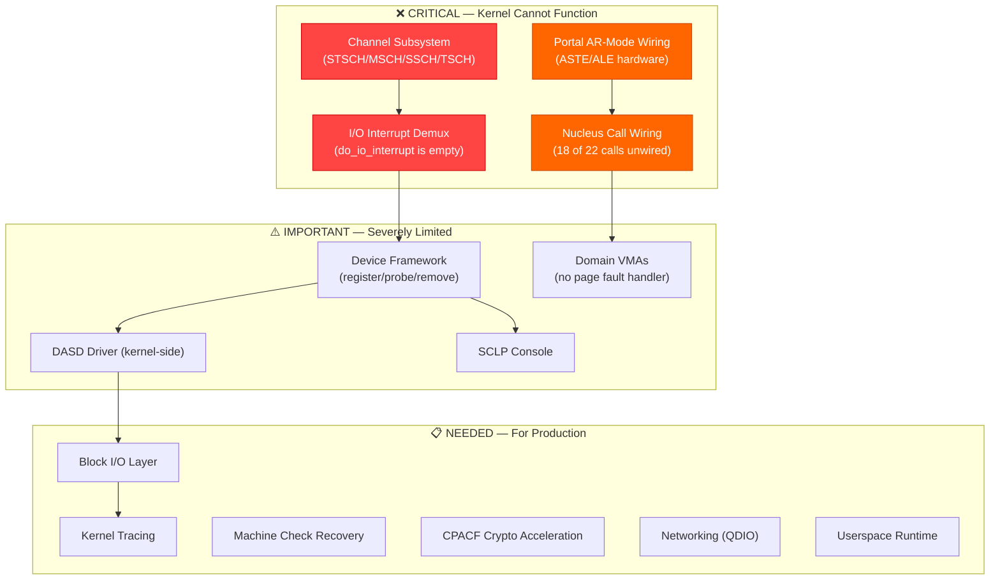
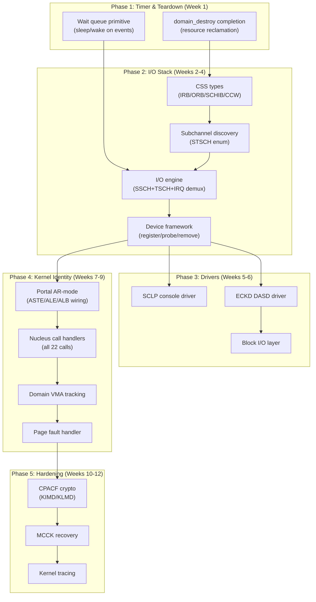
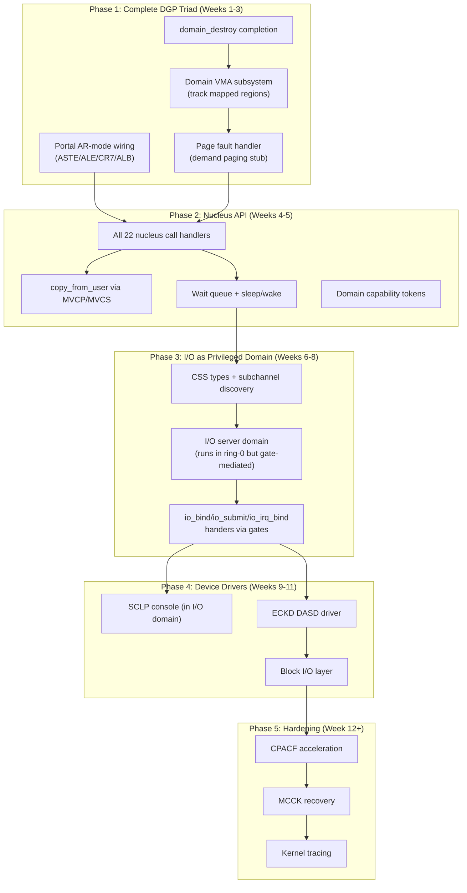

# ZXFoundation Kernel Design — PHASE I: System Design

> **Date**: 2026-06-17 | **Release**: 26h1 (build #225) | **Status**: ARCHITECTURAL ANALYSIS  
> **Scope**: Complete design document covering 110+ modules, ~18,000 lines of C++23 kernel code  
> **Method**: Full source tree analysis — every `.cxxm`, `.S`, `.c`, `.h`, manifest, cmake, and documentation file read and cross-referenced

---

## 0. EXECUTIVE SUMMARY

ZXFoundation is a **capability-gated domain kernel** for IBM z/Architecture — built on three hardware primitives that **do not exist on any other ISA**:

| Primitive | z/Arch Hardware | Kernel Abstraction |
|-----------|----------------|--------------------|
| **Domain** | ASCE (CR1) + Storage Key (SSKE/ISKE) | Isolated address space — the unit of protection |
| **Gate** | SVC instruction → dispatch table | Controlled entry point — the unit of invocation |
| **Portal** | Access Registers (SAR/EAR) + ALET + ASTE/ALE | Controlled data window — the unit of sharing |

**What exists and works today:**
- ✅ Full boot chain (IPL → ZXFL Stage 1/2 → ZXVL verified launch → head64.S → main)
- ✅ 27-module freestanding C++ standard library (no STL dependency)
- ✅ PMM (buddy + PCP + frame descriptors + transactions + typed folios)
- ✅ SLUB slab allocator (3-tier fast path + obfuscated freelists + typed caches)
- ✅ kmalloc (13 size classes)
- ✅ 5-level MMU (transactional map/unmap/protect + EDAT-1/EDAT-2 large pages)
- ✅ Full SMP bringup (SIGP protocol, per-CPU data, lowcore management, IPI)
- ✅ EEVDF scheduler (fair + idle classes, work-stealing, deadline preemption)
- ✅ QSpinlock (MCS-based) + seqlock + RAII guards
- ✅ Timer subsystem (per-CPU min-heap, clock comparator arming, periodic + oneshot)
- ✅ Trap/IRQ framework (PGM/EXT/IO/SVC/MCCK stubs + dispatch)
- ✅ RCU (non-preemptive, callback drain, grace period management)
- ✅ Gate subsystem (dispatch table, handler registration, nucleus call dispatch)
- ✅ Portal registry (bookkeeping-level create/destroy/find)
- ✅ Domain lifecycle (create/activate/destroy/reap with storage key allocation)
- ✅ printk (ring buffer + multi-backend), time (TOD-based), syschk (crash records)
- ✅ zxallsyms (kernel symbol table for stack traces)
- ✅ SHA-256 crypto (software-only)
- ✅ DIAG 8 console driver
- ✅ ELF loader (loads ET_EXEC, maps pages, sets storage keys)

**What is missing — what prevents this from being a real kernel:**



---

## 1. COMPREHENSIVE GAP ANALYSIS

### 1.1 CPU Features: Detected but Unused

The kernel detects the following facilities via STFLE but **never uses them** at runtime:

| Facility | Bit | Status | Impact |
|----------|-----|--------|--------|
| **CPACF/KIMD** | (MSA) | ❌ Not even detected | SHA-256 is pure software — 10-50x slower than KIMD instruction |
| **Guarded Storage** | 133 | Detected, unused | Could enforce domain memory boundaries at hardware level |
| **Vector Extensions** | 129/134/135 | Detected, **actively disabled** (`-mno-vx`) | No SIMD for crypto, string ops, or memory operations |
| **Transactional Execution** | (TX) | Not detected | Could replace spinlocks with hardware transactions for short critical sections |
| **PFMF** | 14 | Detected, unused | Could zero/set-key pages without kernel mapping — 10x faster than memset for page clearing |
| **Enhanced STFLE** | 7 | Used only for detection | Good — but detection results are not checked for minimum facility requirements |

> [!WARNING]
> **`-mno-vx` in the toolchain** means the compiler cannot generate any vector instructions even if CPACF (which uses vector registers for crypto on z13+) is used via inline assembly. This is intentional for now (soft-float kernel), but CPACF intrinsics for SHA/AES would require reconsidering this flag for specific translation units.

### 1.2 Subsystem Gap Details

#### ❌ GAP 1: Channel Subsystem (THE Blocker)

z/Architecture I/O is **entirely** channel-based. There is no MMIO, no PCI BAR, no port I/O. Every device — DASD, network, console, tape — is accessed through the Channel Subsystem using:

```
STSCH (Store Subchannel)     — read subchannel status
MSCH (Modify Subchannel)     — enable/disable subchannel
SSCH (Start Subchannel)      — start I/O with CCW chain
TSCH (Test Subchannel)       — acknowledge I/O completion
CSCH (Clear Subchannel)      — cancel I/O
HSCH (Halt Subchannel)       — halt I/O
```

**What's needed:**
1. **Subchannel types** — IRB (Interruption Response Block), ORB (Operation Request Block), SCHIB (Subchannel Information Block), CCW (Channel Command Word)
2. **Subchannel discovery** — enumerate all 65536 subchannels via STSCH loop
3. **Subchannel enable/disable** — MSCH to set/clear E-bit
4. **I/O request engine** — SSCH + interrupt-driven TSCH polling
5. **CCW chain builder** — type-safe, not raw C structs
6. **I/O interrupt demux** — route interrupts to the correct waiter

The bootloader has raw CCW I/O in C ([dasd_io.c](file:///home/assembler-0/workspace/UltraSpark/arch/s390x/init/zxfl/common/dasd_io.c)), but the kernel has **zero** CSS infrastructure.

#### ❌ GAP 2: I/O Interrupt Path

[do_io_interrupt](file:///home/assembler-0/workspace/UltraSpark/arch/s390x/trap/trap.cxxm#L109-L113) is completely empty:

```cpp
extern "C" auto do_io_interrupt(...) noexcept -> void {
    (void)frame;
    // I/O routing requires CSS multiplexer (domain→subchannel ownership).
}
```

The [entry.S](file:///home/assembler-0/workspace/UltraSpark/arch/s390x/trap/entry.S#L104-L110) stub correctly saves the frame and calls this handler, but nothing happens.

#### ❌ GAP 3: Nucleus Call Wiring

[gate_types.cxxm](file:///home/assembler-0/workspace/UltraSpark/zxfoundation/gate/gate_types.cxxm#L48-L87) defines 22 nucleus calls. Only **4** are implemented in [nucleus_handlers.cxxm](file:///home/assembler-0/workspace/UltraSpark/zxfoundation/gate/nucleus_handlers.cxxm#L175-L189):

| Call | # | Status | Handler |
|------|---|--------|---------|
| `domain_create` | 0 | ❌ | — |
| `domain_destroy` | 1 | ❌ | — |
| `domain_exit` | 2 | ✅ | `nc_domain_exit_handler` |
| `domain_info` | 3 | ✅ | `nc_domain_info_handler` |
| `mem_alloc` | 4 | ❌ | — |
| `mem_free` | 5 | ❌ | — |
| `mem_map` | 6 | ❌ | — |
| `mem_unmap` | 7 | ❌ | — |
| `mem_protect` | 8 | ❌ | — |
| `mem_share` | 9 | ❌ | — |
| `gate_create` | 10 | ❌ | — |
| `gate_destroy` | 11 | ❌ | — |
| `portal_create` | 12 | ❌ | — |
| `portal_destroy` | 13 | ❌ | — |
| `io_bind` | 14 | ❌ | — |
| `io_unbind` | 15 | ❌ | — |
| `io_submit` | 16 | ❌ | — |
| `io_irq_bind` | 17 | ❌ | — |
| `time_yield` | 18 | ✅ | `nc_time_yield_handler` |
| `time_deadline` | 19 | ❌ | — |
| `time_now` | 20 | ❌ | — |
| `console_write` | 21 | ✅ | `nc_console_write_handler` |

#### ❌ GAP 4: Portal Hardware Wiring

[portal.cxxm](file:///home/assembler-0/workspace/UltraSpark/zxfoundation/portal/portal.cxxm#L163-L167) explicitly notes:

```cpp
// NOTE: ASTE/ALE hardware setup is deferred until domain context
//       switch into AR mode. ar::set_ar() will be called when
//       the portal is activated during AR-mode entry.
```

The [ar.cxxm](file:///home/assembler-0/workspace/UltraSpark/arch/s390x/cpu/ar.cxxm) module provides the raw instructions (SAR, EAR, SAC, ALB purge) but **nothing programs the ASTE/ALE tables** that the hardware needs to resolve ALETs to address spaces.

#### ⚠️ GAP 5: Domain Virtual Memory

The MMU can map/unmap pages ([mmu.cxxm](file:///home/assembler-0/workspace/UltraSpark/arch/s390x/mmu/mmu.cxxm)), but there is:
- No per-domain VMA tracking (what regions are mapped, with what permissions)
- No useful page fault handler — [do_pgm_check](file:///home/assembler-0/workspace/UltraSpark/arch/s390x/trap/trap.cxxm#L33-L73) kills the domain on any fault
- No demand paging, no copy-on-write
- No memory mapping of objects

#### ⚠️ GAP 6: Real Console

DIAG 8 ([diag.cxxm](file:///home/assembler-0/workspace/UltraSpark/drivers/console/diag.cxxm)) is Hercules-only. Real z/Architecture uses SCLP (Service-Call Logical Processor). The bootloader has SCLP code in C ([sclp.c](file:///home/assembler-0/workspace/UltraSpark/arch/s390x/init/zxfl/common/sclp.c)) but the kernel does not.

### 1.3 Design Tensions

1. **Storage Key Exhaustion**: Only 8 user keys (8-15), but `MAX_DOMAINS=256`. The kernel must implement key sharing/virtualization.

2. **ALET Monotonic Counter**: [portal.cxxm:141](file:///home/assembler-0/workspace/UltraSpark/zxfoundation/portal/portal.cxxm#L141) uses `g_next_alet++` — this never recycles ALETs. After 2^32 portal creates, it wraps.

3. **Static Limits**: `MAX_DOMAINS=256`, `MAX_GATES=512`, `MAX_PORTALS=1024`, `MAX_CPUS=128`, `TIMER_HEAP_CAPACITY=256`, `SLUB_MAX_CACHES=64`. All static arrays.

4. **Work-stealing Race**: [sched.cxxm:67-93](file:///home/assembler-0/workspace/UltraSpark/zxfoundation/sched/sched.cxxm#L67-L93) unlocks the local rq, then re-acquires both in order. Between unlock and re-lock, another CPU could steal from the same busiest rq.

5. **copy_from_user is page-walk-based**: [nucleus_handlers.cxxm:45-71](file:///home/assembler-0/workspace/UltraSpark/zxfoundation/gate/nucleus_handlers.cxxm#L45-L71) manually walks page tables. On real z/Architecture, `MVCP`/`MVCS` instructions can copy between primary/secondary address spaces in hardware — much faster and atomic.

---

## 2. PROTOTYPE DESIGNS

### PROTOTYPE A: "Foundation-First" (Bottom-Up)

**Philosophy**: Build the I/O stack first, then complete the domain/gate/portal triad on top of working I/O. The kernel gets "legs" (can talk to devices) before it gets its "identity" (portals).



**Strengths:**
- Gets real device I/O working early — kernel can read DASD, talk to console
- Each phase produces testable, observable results
- CSS/DASD code can reference the bootloader's working C implementation for architecture knowledge
- Wait queues enable sleep-on-I/O, which CSS needs

**Weaknesses:**
- Delays the kernel's unique identity (portals) to Phase 4
- CSS in the nucleus (not a privileged domain) — less clean architecturally
- Heavy I/O focus may distract from the DGP (Domain-Gate-Portal) triad that defines ZXFoundation

---

### PROTOTYPE B: "Identity-First" (Capability-First)

**Philosophy**: Complete the DGP triad first — portals, gates, and full nucleus call set. Make the kernel's *unique architecture* work before adding device I/O. The kernel proves its capability model with synthetic workloads before touching hardware.



**Strengths:**
- Completes the kernel's architectural identity first — what makes ZXFoundation *ZXFoundation*
- Portals are the most innovative feature; proving they work is the highest-value outcome
- CSS-as-domain is architecturally cleaner and demonstrates the capability model
- All domain/gate/portal code can be tested with synthetic inter-domain communication

**Weaknesses:**
- Longer before the kernel can talk to real hardware
- CSS-as-privileged-domain adds complexity (gate-mediated I/O has overhead)
- AR-mode debugging is notoriously difficult — opaque hardware failures
- Risk of over-engineering the capability model before real workloads stress-test it

---

## 3. VERDICT: HYBRID APPROACH (A + B Merged)

> [!IMPORTANT]
> **Neither prototype alone is optimal.** Prototype A gets results fast but delays identity. Prototype B is architecturally pure but delays practical usability. The correct approach merges them.

### The Hybrid: "Parallel Tracks"

**Track 1 (Foundation + I/O):** domain_destroy → wait queues → CSS types → subchannel discovery → I/O engine → SCLP console  
**Track 2 (Identity):** Portal AR-mode → VMA tracking → nucleus call handlers → page fault handler

These tracks share **no module dependencies** and can proceed simultaneously:
- Track 1 touches: `arch/s390x/css/` (new), `arch/s390x/trap/trap.cxxm`, `drivers/console/`
- Track 2 touches: `zxfoundation/portal/`, `zxfoundation/gate/`, `zxfoundation/domain/`, `arch/s390x/cpu/ar.cxxm`

### Unified Execution Plan

| Priority | Track | Task | Depends On | New Modules | Edits |
|----------|-------|------|------------|-------------|-------|
| **1** | Foundation | Wait queue primitive | Timer (exists) | `zxfoundation/sync/waitqueue_types.cxxm`, `waitqueue.cxxm` | — |
| **2** | Foundation | Domain destroy + resource reclaim | PMM, gate, portal (exist) | — | Edit `domain.cxxm`, `sched.cxxm` |
| **3** | Identity | Portal AR-mode (ASTE/ALE/ALB) | Domain, MMU (exist) | `arch/s390x/cpu/aste_types.cxxm`, `aste.cxxm` | Edit `portal.cxxm`, `ar.cxxm` |
| **4** | Foundation | CSS types (IRB/ORB/SCHIB/CCW) | None | `arch/s390x/css/css_types.cxxm` | — |
| **5** | Identity | Domain VMA tracking | MMU (exists) | `zxfoundation/memory/vma_types.cxxm`, `vma.cxxm` | — |
| **6** | Foundation | Subchannel discovery (STSCH) | CSS types (#4) | `arch/s390x/css/css.cxxm` | — |
| **7** | Foundation | I/O engine (SSCH/TSCH) + IRQ demux | CSS (#6), WaitQ (#1) | `arch/s390x/css/io_engine.cxxm` | Edit `trap.cxxm` |
| **8** | Identity | Nucleus call handlers (all 22) | Portal HW (#3), VMA (#5) | — | Edit `nucleus_handlers.cxxm` |
| **9** | Foundation | Device framework | CSS (#6) | `zxfoundation/dev/device_types.cxxm`, `device.cxxm` | — |
| **10** | Identity | Page fault handler | VMA (#5) | — | Edit `trap.cxxm` |
| **11** | Both | SCLP console driver | DevFW (#9) | `drivers/console/sclp_types.cxxm`, `sclp.cxxm` | — |
| **12** | Both | ECKD DASD driver | DevFW (#9), CSS (#6) | `drivers/dasd/eckd_types.cxxm`, `eckd.cxxm` | — |
| **13** | Both | Block I/O layer | DASD (#12) | `zxfoundation/block/block_types.cxxm`, `block.cxxm` | — |
| **14** | Hardening | CPACF crypto (KIMD/KLMD) | Features (exists) | — | Edit `crypto/sha256.cxxm` |
| **15** | Hardening | Machine check recovery | Trap (exists) | `arch/s390x/cpu/mcck.cxxm` | Edit `trap.cxxm` |
| **16** | Hardening | Kernel tracing | printk (exists) | `zxfoundation/sys/trace_types.cxxm`, `trace.cxxm` | — |

---

## 4. ARCHITECTURE DECISIONS REQUIRED

Before implementation begins, these decisions must be resolved:

### Decision 1: Storage Key Sharing

Only 8 user keys (8-15). `MAX_DOMAINS=256`. Three options:

| Option | Mechanism | Pros | Cons |
|--------|-----------|------|------|
| **A. Key Pool** | Domains share keys; revoke on context switch via SSKE | Simple, proven (z/VM does this) | SSKE on every page on switch = expensive |
| **B. Key Virtualization** | Use storage keys only for active domains; swap key meaning on switch | Minimal SSKE calls | Complex bookkeeping; concurrent domain access requires same key |
| **C. Key Groups** | Domains in same security domain share a key; max 8 security domains | Natural for capability model | Limits isolation granularity |

> **Recommendation**: **Option C** — aligns with the DGP model. A "security domain" maps to a storage key group. Portals between domains in the same group are free (same key). Portals across groups require portal hardware.

### Decision 2: CSS Model

| Option | Where CSS Runs | I/O Path | Performance |
|--------|---------------|----------|-------------|
| **A. In Nucleus** | Kernel code, direct SSCH/TSCH | Domain → SVC → nucleus CSS → device | Fast, 1 context switch |
| **B. Privileged Domain** | Separate domain with gate access | Domain → Gate → CSS domain → device | 2 context switches, but architecturally clean |
| **C. Hybrid** | Core CSS in nucleus, drivers in domains | Domain → SVC → nucleus start I/O; completion → domain callback | Best of both — fast path in nucleus, policy in domains |

> **Recommendation**: **Option C** — the CSS core (SSCH/TSCH/STSCH) must be in the nucleus for performance (these are privileged instructions anyway). Device drivers can be domains that register gate handlers. The `io_submit` nucleus call starts I/O directly.

### Decision 3: Timer Resolution

| Option | Granularity | Mechanism | Cost |
|--------|-------------|-----------|------|
| **A. Tick-based** | 10ms (100 Hz) | Periodic timer fires, processes heap | Low overhead, coarse |
| **B. Tickless (hrtimer)** | Sub-microsecond | Program clock comparator to exact next deadline | Per-timer comparator reprogram |
| **C. Hybrid** | Tick for accounting, tickless for deadlines | Periodic tick + one-shot comparator for earliest deadline | Best of both |

> **Recommendation**: **Option C** — already partially implemented! The timer subsystem ([timer.cxxm](file:///home/assembler-0/workspace/UltraSpark/zxfoundation/sys/timer.cxxm)) already programs the clock comparator to the exact next deadline in the heap. The scheduler tick ([sched.cxxm:289-301](file:///home/assembler-0/workspace/UltraSpark/zxfoundation/sched/sched.cxxm#L289-L301)) is already a periodic timer entry. The foundation is correct; we just need to expose `timer_add` via a nucleus call for domain-level timers.

### Decision 4: Portal Consent Model

| Option | Who Authorizes? | Mechanism |
|--------|----------------|-----------|
| **A. Unilateral** | Nucleus creates portal; target domain not consulted | Simple but insecure |
| **B. Bilateral** | Target domain must call `portal_accept()` to consent | Secure but complex; requires IPC |
| **C. Capability Token** | Nucleus issues opaque token to target; source presents token to create portal | Secure, no direct IPC needed |

> **Recommendation**: **Option C** — capability tokens align with the DGP philosophy. The nucleus issues a `portal_token` (unforgeable 64-bit value) to the target domain via a gate call. The source domain presents this token to `portal_create`. The nucleus validates the token.

### Decision 5: Domain Memory Layout

| Option | Layout | Flexibility |
|--------|--------|-------------|
| **A. Fixed regions** | text/data/bss/heap/stack at predefined VA ranges | Simple, predictable |
| **B. Fully flexible** | `mem_map` maps anything anywhere | Maximum flexibility, complex VMA tracking |
| **C. Zone-based** | Pre-defined zones (code, data, heap, stack, portal) with flexible sub-allocation | Balance of simplicity and flexibility |

> **Recommendation**: **Option C** — zone-based. Predefined virtual address zones ensure the nucleus can enforce invariants (e.g., code zone is always non-writable-but-executable), while domains can freely allocate within zones.

---

## 5. NEW MODULE INVENTORY

### 5.1 Track 1: Foundation + I/O

```
arch/s390x/css/
├── manifest.zxd
├── css_types.cxxm          # IRB, ORB, SCHIB, CCW, SCSW types
├── css.cxxm                # STSCH/MSCH enumeration, subchannel enable/disable
├── io_engine.cxxm          # SSCH/TSCH I/O start/complete, IRQ demux
└── ccw_builder.cxxm        # Type-safe CCW chain construction

zxfoundation/sync/
├── manifest.zxd
├── waitqueue_types.cxxm    # wait_queue_head, wait_queue_entry types
└── waitqueue.cxxm          # sleep/wake, condition wait, timeout wait

zxfoundation/dev/
├── manifest.zxd
├── device_types.cxxm       # device, driver, bus types
└── device.cxxm             # register/unregister, probe/remove lifecycle

drivers/console/
├── sclp_types.cxxm         # SCLP event buffer types
└── sclp.cxxm               # SCLP console read/write

drivers/dasd/
├── manifest.zxd
├── eckd_types.cxxm         # ECKD geometry, DE/LO CCW types
└── eckd.cxxm               # ECKD DASD read/write/format

zxfoundation/block/
├── manifest.zxd
├── block_types.cxxm        # bio, request_queue types
└── block.cxxm              # Block I/O request submission/completion
```

### 5.2 Track 2: Identity

```
arch/s390x/cpu/
├── aste_types.cxxm         # ASTE, ALE, ALT, ALET types
└── aste.cxxm               # ASTE/ALE table management, ALET allocation

zxfoundation/memory/
├── vma_types.cxxm          # vm_area, vm_region types
└── vma.cxxm                # VMA insert/remove/find/split/merge
```

### 5.3 Hardening

```
arch/s390x/cpu/
└── mcck.cxxm               # Machine check analysis + recovery

zxfoundation/sys/
├── trace_types.cxxm        # Trace event, trace buffer types
└── trace.cxxm              # Per-CPU trace ring buffers, event recording
```

**Total new modules: ~20**  
**Total edits to existing modules: ~8**

---

## 6. IMPLEMENTATION PRIORITY MATRIX

| # | Module | LOC Est. | Complexity | Risk | Blocks |
|---|--------|----------|------------|------|--------|
| 1 | `waitqueue.cxxm` | 200 | Medium | Low | CSS I/O, timers, nucleus calls |
| 2 | `domain.cxxm` edit | 100 | Low | Low | Nothing (cleanup) |
| 3 | `aste_types.cxxm` + `aste.cxxm` | 400 | **HIGH** | **HIGH** | Portal functionality |
| 4 | `css_types.cxxm` | 300 | Medium | Low | All I/O |
| 5 | `vma_types.cxxm` + `vma.cxxm` | 400 | Medium | Medium | Page fault handling |
| 6 | `css.cxxm` | 300 | Medium | Medium | I/O engine |
| 7 | `io_engine.cxxm` + `trap.cxxm` edit | 400 | **HIGH** | **HIGH** | All device drivers |
| 8 | `nucleus_handlers.cxxm` edit | 500 | Medium | Medium | Userspace API |
| 9 | `device.cxxm` | 300 | Medium | Low | Drivers |
| 10 | `trap.cxxm` pgm edit | 200 | Medium | Medium | Demand paging |
| 11 | `sclp.cxxm` | 300 | Medium | Medium | Real console |
| 12 | `eckd.cxxm` | 400 | **HIGH** | Medium | Block layer |
| 13 | `block.cxxm` | 300 | Medium | Low | Filesystem (future) |
| 14 | `sha256.cxxm` CPACF edit | 150 | Low | Low | Faster crypto |
| 15 | `mcck.cxxm` | 200 | Medium | Medium | Reliability |
| 16 | `trace.cxxm` | 300 | Medium | Low | Diagnostics |

**Total estimated new code: ~4,750 lines**  
**Total estimated edits: ~1,500 lines**  
**Combined: ~6,250 lines — expanding the kernel by ~35%**

---

## 7. WHAT WE BUILD FIRST

> [!TIP]
> **Start with items 1-4 simultaneously**: Wait queues (#1), domain destroy fix (#2), ASTE/ALE types (#3), and CSS types (#4). These four tasks have zero dependencies on each other and collectively unblock everything else.
>
> After those land, items 5-7 (VMA, CSS engine, I/O demux) can proceed in parallel.
>
> The goal: within 4 weeks, the kernel can create and destroy domains cleanly, set up AR-mode portals with real hardware backing, enumerate subchannels, and start I/O to devices.

---

## 8. OPEN QUESTIONS FOR THE USER

Before I proceed to Phase II (Interface Definition), I need answers to:

1. **Storage key sharing model** — Option A/B/C from §4.1?
2. **CSS placement** — In nucleus, privileged domain, or hybrid (§4.2)?
3. **Portal consent** — Unilateral, bilateral, or capability token (§4.4)?
4. **Domain memory layout** — Fixed, flexible, or zone-based (§4.5)?
5. **Which items should I start implementing first?**
6. **Is there a preference for Track 1 (I/O) or Track 2 (Identity) priority?**
7. **Should the ZXFL bootloader's SCLP/DASD code be used as reference for the kernel implementations?**
