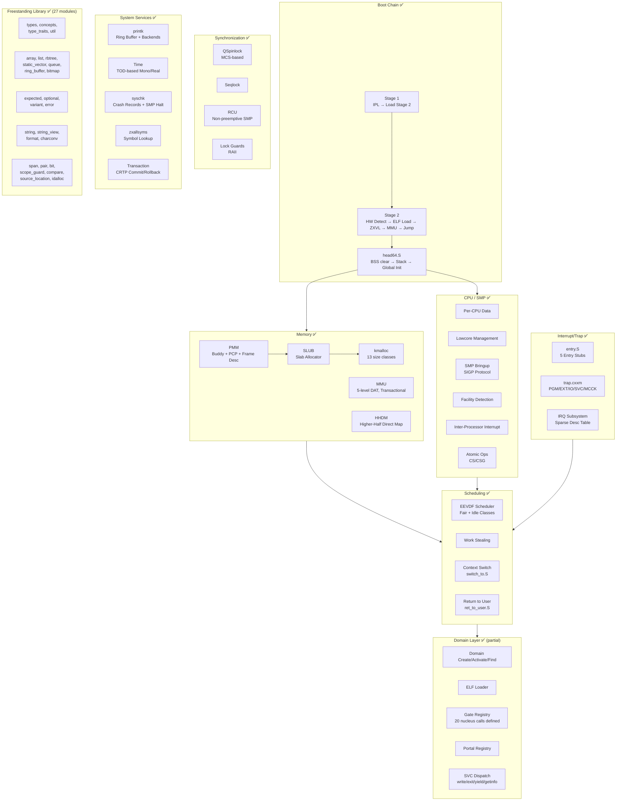
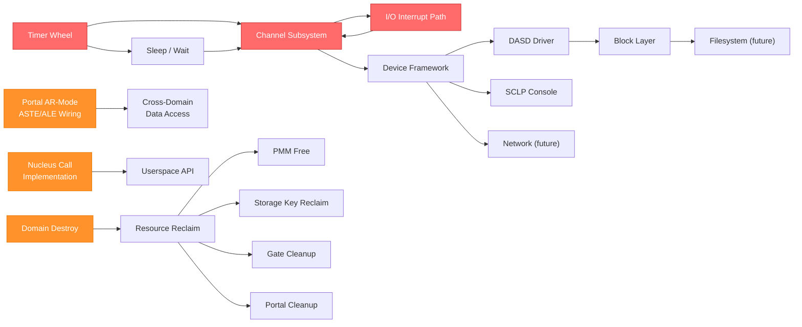

# ZXFoundation Kernel Map — Complete Architecture Analysis

> **Date**: 2026-06-16 | **Release**: 26h1 | **Analyst**: Lead Architect  
> **Scope**: Every source file in the UltraSpark tree — 120+ files, ~15,000 lines of kernel C++23 modules

---

## 0. WHAT ZXFOUNDATION IS

Before listing subsystems, I need to name what I see. This kernel is **not** a microkernel, **not** a monolithic kernel. It is something else — a **capability-gated domain kernel** built on three primitives:

| Primitive | z/Arch Hardware | Purpose |
|-----------|----------------|---------|
| **Domain** | ASCE + Storage Key | Isolated address space — the unit of protection |
| **Gate** | SVC instruction | Controlled entry point — the unit of invocation |
| **Portal** | Access Registers + ALET | Controlled data window — the unit of sharing |

This triad exploits z/Architecture features (AR-mode, storage keys, ASCE switching) that **do not exist** on any other architecture. AR-mode lets a single instruction stream reference up to 16 different address spaces simultaneously with hardware-enforced permission checks. Storage keys provide per-page access control without page table manipulation. This is the kernel's identity.

---

## 1. COMPLETE SUBSYSTEM INVENTORY

### 1.1 What EXISTS and is FUNCTIONAL

### 1.2 Subsystem Maturity Assessment

| Subsystem | Files | Lines | Status | Notes |
|-----------|-------|-------|--------|-------|
| **Bootloader (ZXFL)** | 21 C + 21 headers | ~2,800 | ✅ Complete | ECKD/FBA/tape, ZXVL, ELF load, MMU, system detect |
| **Freestanding Library** | 27 modules | ~5,300 | ✅ Complete | Full STL replacement, s390x-optimized string ops |
| **PMM** | 2 modules | ~900 | ✅ Complete | Buddy, PCP, frame desc, transactions, NUMA-aware zones |
| **SLUB + kmalloc** | 4 modules | ~1,100 | ✅ Complete | 3-tier fast path, typed caches, obfuscated freelists |
| **MMU** | 4 modules | ~900 | ✅ Complete | 5-level DAT, transactional map/unmap, EDAT-1/2 |
| **CPU/SMP** | 26 modules | ~2,200 | ✅ Complete | Full AP bringup, per-CPU, IPI, STFLE, STSI, SIGP |
| **Locking** | 4 modules | ~500 | ✅ Complete | QSpinlock (MCS), seqlock, RAII guards |
| **Atomics** | 1 module | 385 | ✅ Complete | CS/CSG-based, full memory order support |
| **EEVDF Scheduler** | 2 modules + 2 asm | ~700 | ✅ Functional | Fair+idle classes, work-stealing, preemption |
| **Trap/IRQ** | 2 asm + 2 modules | ~700 | ⚠️ Functional | IO handler is placeholder, MCCK is log-only |
| **RCU** | 2 modules | ~350 | ✅ Complete | Non-preemptive, callback drain, GP management |
| **Domain** | 2 modules | ~400 | ⚠️ Partial | Create/activate works; **destroy is NYI** |
| **ELF Loader** | 3 modules | ~350 | ✅ Functional | Loads ET_EXEC, maps pages, sets storage keys |
| **Gate** | 3 modules | ~400 | ⚠️ Skeleton | 20 calls defined, dispatch works, **handlers unwired** |
| **Portal** | 2 modules | ~250 | ⚠️ Skeleton | Registry works, **AR/ASTE/ALE hardware setup deferred** |
| **printk** | 2 modules | ~350 | ✅ Complete | Ring buffer, multi-backend, log levels |
| **Console** | 1 module | ~100 | ✅ Complete | DIAG 8 hypervisor console |
| **Time** | 1 module | ~200 | ✅ Complete | TOD-based, seqlock wall clock |
| **Timer** | 1 module | ~50 | ❌ Interface Only | Types defined, **no wheel/heap/scheduling** |
| **Crypto** | 2 modules | ~350 | ⚠️ Partial | SHA-256 software-only, **no CPACF/KIMD** |
| **syschk** | 2 modules | ~300 | ✅ Complete | Crash records, SMP halt, disabled-wait |
| **zxallsyms** | 2 modules + stub | ~200 | ✅ Complete | Binary search by addr, linear by name |

---

## 2. WHAT IS MISSING

### 2.1 CRITICAL — Kernel Cannot Function Without These

#### ❌ Channel Subsystem (CSS) — THE Gap

z/Architecture I/O is **entirely** channel-based. Every device — DASD, network, console, tape — is accessed through the Channel Subsystem. The bootloader has raw CCW I/O (`dasd_io.c`), but the kernel has **zero** CSS infrastructure.

**What's needed:**
- Subchannel discovery (STSCH enumeration loop over all 65536 subchannels)
- Subchannel enable/disable (MSCH)
- I/O request engine (SSCH + TSCH polling or interrupt-driven)
- I/O interrupt demultiplexing (`do_io_interrupt()` is currently empty)
- CCW chain builder (type-safe, not raw C structs)
- Device recognition and classification
- Path management (multipath I/O)

**Why it's critical:** Without CSS, the kernel is blind and mute after boot. It cannot access any device. The DIAG 8 console is a Hercules-only hack.

#### ❌ Timer Infrastructure

`timer_types.cxxm` defines `kernel_timer` but nothing schedules them. The clock comparator fires ticks, but there's no mechanism for:
- Deferred function execution (sleeping, timeouts)
- Periodic callbacks
- One-shot timers
- Any form of "do X after Y nanoseconds"

**Why it's critical:** Without timers, no sleep(), no timeout on I/O, no watchdogs, no periodic maintenance.

#### ❌ Domain Destruction + Resource Reclamation

`domain_destroy()` returns `not_implemented`. When a domain dies:
- Its page tables leak
- Its physical pages leak
- Its kernel stack leaks
- Its storage key is never reclaimed
- Its gates and portals are never cleaned up
- Its scheduler entity remains

**Why it's critical:** The kernel will eventually OOM from leaked domains.

#### ❌ I/O Interrupt Handling

`do_io_interrupt()` in `trap.cxxm` is a stub. I/O interrupts carry subchannel status (IRB) that must be demultiplexed to the correct device driver/waiter. Without this, interrupt-driven I/O is impossible.

---

### 2.2 IMPORTANT — Kernel Is Severely Limited Without These

#### ❌ Device Driver Framework

No registration model. No probe/remove lifecycle. No bus abstraction. Currently only 1 driver (DIAG 8 console), hardcoded. The gate_types.cxxm defines `io_bind/unbind/submit/irq_bind` nucleus calls, signaling intent, but nothing implements them.

#### ❌ Block Device Layer + DASD Driver

The bootloader has ECKD/FBA drivers in C, but the kernel has none. After boot, the kernel cannot read or write DASD. No block I/O request queue, no elevator/scheduler for I/O requests.

#### ❌ Real Console Driver

DIAG 8 is hypervisor-only. Bare-metal z/Architecture uses:
- SCLP (Service-Call Logical Processor) for operator console
- 3270 data stream for full-screen terminals
- 3215 line-mode

The bootloader has SCLP code. The kernel does not.

#### ❌ Virtual Memory Management for Domains

The MMU can map/unmap pages, but there is no:
- Per-domain virtual memory area (VMA) tracking
- Page fault handler that does anything useful (currently kills the domain)
- Demand paging
- Copy-on-write
- Memory mapping of objects/files

#### ❌ Nucleus Call Implementation

20 nucleus calls are defined in `gate_types.cxxm`:

| Call | Status |
|------|--------|
| `domain_create` | ❌ Unwired |
| `domain_destroy` | ❌ Unwired (+ backend NYI) |
| `domain_info` | ❌ Unwired |
| `gate_create` | ❌ Unwired |
| `gate_destroy` | ❌ Unwired |
| `portal_create` | ❌ Unwired |
| `portal_destroy` | ❌ Unwired |
| `mem_map` | ❌ Unwired |
| `mem_unmap` | ❌ Unwired |
| `mem_alloc` | ❌ Unwired |
| `mem_free` | ❌ Unwired |
| `mem_protect` | ❌ Unwired |
| `mem_share` | ❌ Unwired |
| `io_bind` | ❌ Unwired |
| `io_unbind` | ❌ Unwired |
| `io_submit` | ❌ Unwired |
| `io_irq_bind` | ❌ Unwired |
| `time_yield` | ❌ Unwired |
| `time_deadline` | ❌ Unwired |
| `time_now` | ❌ Unwired |

The SVC handler (`do_svc`) dispatches 4 hardcoded SVCs directly, bypassing the gate mechanism entirely. These two dispatch paths need to be unified.

#### ❌ Portal Hardware Wiring

Portal registry works at the bookkeeping level but never programs:
- ASTE (ASN Second Table Entry) for the target address space
- ALE (Access List Entry) linking ALET → ASTE
- ALB (Access List Buffer) management
- CR7 (primary ASN control) for AR-mode

Without this, AR-mode cross-domain access is impossible.

---

### 2.3 NEEDED — For a Production-Quality Kernel

| Category | Missing Component |
|----------|------------------|
| **Diagnostics** | Kernel tracing/event infrastructure |
| **Diagnostics** | Performance counters / CPU measurement facility |
| **Diagnostics** | Crash dump generation (SA/standalone dump) |
| **Diagnostics** | Kernel debugger (DIAG-based or SCLP-based) |
| **Memory** | NUMA-aware allocation policies (PMM has zones but ignores NUMA at alloc time) |
| **Memory** | Page reclaim / eviction (if swap is ever desired) |
| **Memory** | Memory hotplug (standby → online frames) |
| **Crypto** | CPACF acceleration (KIMD/KLMD for SHA, KM/KMC for AES) |
| **Reliability** | Machine check recovery (MCCK handler only logs) |
| **Reliability** | CPU hotplug / deconfigure |
| **Reliability** | ECC / memory error handling |
| **SMP** | CPU affinity for domains |
| **SMP** | NUMA-aware scheduling |
| **Networking** | QDIO (Queued Direct I/O) framework |
| **Networking** | OSA-Express / HiperSockets driver |
| **Userspace** | Userspace runtime library |
| **Userspace** | Program loader from filesystem |
| **Security** | Domain capability / permission model |

---

## 3. ARCHITECTURAL TRENDS & DESIGN IDENTITY

### 3.1 Strengths (What ZXFoundation Does RIGHT)

1. **Type Safety as Religion**: `typestate<State>` for lifecycle enforcement, `folio<State>` for memory, `kmem_cache_ref<State>` for slab caches, `expected<T, kernel_error>` everywhere. Compile-time guarantees replace runtime checks.

2. **Hardware Exploitation**: Storage keys for domain isolation, AR-mode for portals, CS/CSG for atomics, MVCL/MVC/CLC for optimized memory ops, TOD clock for nanosecond timing. The kernel speaks z/Architecture natively.

3. **Verified Boot Chain**: ZXVL is genuine — SHA-256 checksums on every PT_LOAD segment, handshake verification, lock sentinels. This is not afterthought security.

4. **Memory Subsystem Depth**: PMM with buddy + PCP + frame descriptors + transactions + typestate folios + zone-aware allocation. SLUB with 3-tier fast path + obfuscated freelists + typed caches. This is production-grade.

5. **Scheduler Sophistication**: EEVDF (not CFS!) with work-stealing, deadline-based preemption, per-CPU run queues with ordered locking. For a kernel this young, this is unusually advanced.

6. **Module System**: C++23 modules eliminate header hell. Module names match filesystem paths. The zx-discovery DSL manages compilation order. This is clean.

### 3.2 Design Tensions I Observe

1. **SVC Path Duality**: `do_svc()` in trap.cxxm handles 4 SVCs directly (write/exit/yield/getinfo). But `gate_types.cxxm` defines 20 nucleus calls with a proper dispatch table (`nucleus_dispatch_table`). These are two separate mechanisms for the same thing. The SVC handler should route through the gate dispatch.

2. **Bootloader vs Kernel Duplication**: The bootloader has its own SHA-256 (C), STFLE, STSI, SCLP, DIAG, string, lowcore, PSW implementations. The kernel has its own (C++ modules). The kernel's `crypto/sha256.cxxm` and the bootloader's `common/sha256.c` are separate codebases. This is fine for isolation but means bug fixes must be applied twice.

3. **Static Limits Everywhere**: `MAX_DOMAINS=256`, `MAX_GATES=512`, `MAX_PORTALS=1024`, `MAX_CPUS=4` (config) / `128` (protocol), `IRQ_NR_MAX=1024`, `SLUB_MAX_CACHES=64`. These are all compile-time constants backed by static arrays. Fine for now, but some will need to become dynamic.

4. **Portal Promise vs Reality**: The portal/gate/domain triad is the kernel's distinguishing architecture, but portals are bookkeeping-only — no AR-mode hardware setup. This is the kernel's most important unfinished work.

---

## 4. DEPENDENCY GRAPH — CRITICAL PATHS

> [!IMPORTANT]
> **Red nodes** are hard blockers — nothing else can proceed without them.  
> **Orange nodes** are critical for the kernel's identity but not blocking other subsystems.

---

## 5. PRIORITIZED EXECUTION PLAN

### Phase A: Foundation Gaps (Unblocks Everything)

| Priority | Task | Depends On | Est. Files |
|----------|------|------------|------------|
| **A1** | Timer wheel/heap infrastructure | Time (exists) | 2-3 modules |
| **A2** | Domain destruction + resource reclamation | PMM, SLUB, gate, portal (exist) | Edit 3-4 modules |
| **A3** | Nucleus call wiring (unify SVC → gate dispatch) | Gate dispatch (exists) | Edit 2-3 modules |

### Phase B: I/O Path (Unblocks All Devices)

| Priority | Task | Depends On | Est. Files |
|----------|------|------------|------------|
| **B1** | I/O interrupt demultiplexing | IRQ subsystem (exists) | Edit trap.cxxm, new module |
| **B2** | Channel Subsystem core (STSCH/MSCH/SSCH/TSCH) | Timer (A1), I/O IRQ (B1) | 4-6 modules |
| **B3** | Device framework (register/probe/remove) | CSS (B2) | 2-3 modules |
| **B4** | SCLP console driver | Device framework (B3) | 2 modules |

### Phase C: Kernel Identity (What Makes ZXF Unique)

| Priority | Task | Depends On | Est. Files |
|----------|------|------------|------------|
| **C1** | Portal AR-mode hardware wiring (ASTE/ALE/ALB) | Domain (exists), MMU (exists) | Edit portal, new arch modules |
| **C2** | Full nucleus call handlers (mem_*, gate_*, portal_*) | A3, C1 | Edit gate/dispatch |
| **C3** | Domain virtual memory areas (VMA tracking) | MMU (exists) | 2-3 modules |
| **C4** | Demand page fault handling | C3, PMM (exists) | Edit trap.cxxm, new module |

### Phase D: Device Ecosystem

| Priority | Task | Depends On | Est. Files |
|----------|------|------------|------------|
| **D1** | ECKD DASD driver (kernel-side) | CSS (B2), Device FW (B3) | 3-4 modules |
| **D2** | Block I/O layer | D1 | 2-3 modules |
| **D3** | 3215/3270 console drivers | CSS (B2), Device FW (B3) | 2-3 modules per |
| **D4** | CPACF crypto acceleration | Crypto (exists) | 1-2 modules |

### Phase E: Reliability & Diagnostics

| Priority | Task | Depends On | Est. Files |
|----------|------|------------|------------|
| **E1** | Machine check recovery | Trap (exists) | Edit trap, new module |
| **E2** | Kernel tracing infrastructure | printk (exists) | 2-3 modules |
| **E3** | Crash dump generation | syschk (exists), block layer (D2) | 2-3 modules |

---

## 6. FILE COUNT & SCALE

| Area | Source Files | Est. Lines |
|------|------------|------------|
| arch/s390x/ | ~65 | ~5,500 |
| zxfoundation/ | ~42 | ~5,200 |
| lib/ | 27 | ~5,300 |
| drivers/ | 1 | ~100 |
| crypto/ | 2 | ~350 |
| tools/ | 3 | ~1,600 |
| scripts/ | 3 | ~50 |
| **TOTAL** | **~143** | **~18,100** |

The kernel is compact but dense. Every line carries weight.

---

## 7. OPEN DESIGN QUESTIONS

These are decisions that must be made before implementation, not things I can decide:

1. **SVC unification**: Should ALL nucleus calls go through the gate dispatch table, or should the 4 "fast SVCs" (write/exit/yield/getinfo) remain hardcoded for performance? The gate dispatch adds one level of indirection.

2. **CSS model**: Should the CSS layer be part of the nucleus (direct kernel code) or should it be a privileged domain with gate-mediated access? The kernel's capability model suggests the latter, but performance may demand the former.

3. **Timer granularity**: The TOD clock gives 244-picosecond resolution, but the tick is 10ms (100Hz). Should timers operate at tick granularity or should there be a high-resolution timer path using the clock comparator directly?

4. **Portal security model**: When a portal is created, who authorizes it? Currently `portal_create` takes raw domain IDs. Should the target domain have to consent? Should there be a capability token?

5. **Domain memory model**: Should domains have a fixed virtual address layout (text/data/bss/heap/stack regions like traditional OS) or should it be fully flexible (map anything anywhere)?

6. **Storage key exhaustion**: Only 16 storage keys (0-15), key 0 is nucleus, 8-15 for domains = max 8 concurrent domains with unique keys. The current code has `MAX_DOMAINS=256`. How are keys shared/recycled among domains?

7. **NUMA policy**: PMM has zones (dma31/normal) but no NUMA node preference. Should allocation respect NUMA topology from boot protocol, or is the 4-CPU Hercules target too small to matter?

---

## 8. WHAT I RECOMMEND WE BUILD FIRST

> [!TIP]
> **Start with A1 + A2 + A3 (foundation gaps), then B1 + B2 (I/O path).** These six tasks unblock everything else and give the kernel its legs. Without timers and CSS, the kernel is a sophisticated idle loop that can run one test binary.

The portal/AR-mode work (C1) is what makes ZXFoundation *ZXFoundation*, but it can proceed in parallel with the I/O path since it has no dependency on CSS.

---
